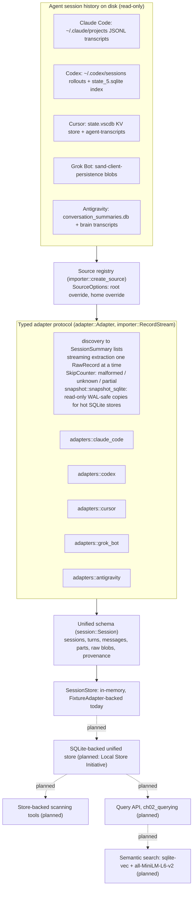
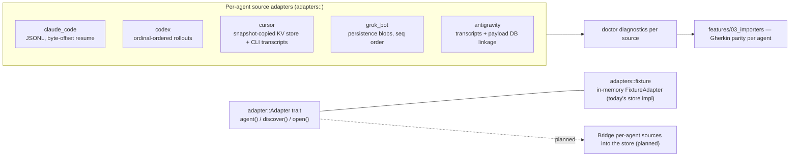
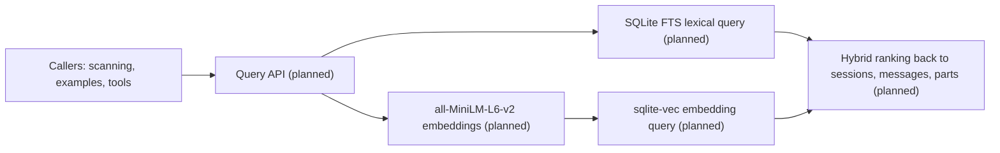

# BotSpy

BotSpy pops open the conversation history of any coding agent: one adapter per agent (Claude Code, Cursor, Codex, Grok Bot, Antigravity, more later), one standard normalized schema, and one unified agent-session history.

The product is the `botspy` Rust **library crate** — library only for now: no binary, no executable, no server, no C API/FFI, no CLI. Metrics live in `examples/` as consumers of the public API, never in the library: a coding-session thanks-vs-F-bombs meter (`examples/meter`), local sentiment analysis with a VADER-style lexicon (`examples/sentiment`), and a stub showing where further session metrics would go (`examples/metrics_stub`). They import only the public API and the standard library, and never add a dependency to the core.

## How it works



The adapter layer in detail — the store-facing `Adapter` trait is implemented by the in-memory `FixtureAdapter` today; the per-agent sources already do discovery, streaming extraction, skip counting, and doctor diagnostics, and their store wiring is planned:



The query path is specified (Chapter 2, `features/02_querying/`) and lands with the Local Store Initiative:



## Specs are the source of truth

BotSpy is a behavior-driven specification project. The Gherkin behavior specifications under `features/` are the backbone and the true source of the project; implementation code is considered generated from the specs. All planning is organized around features and their specs. Work starts by writing or refining the feature spec (with concrete examples), then the step definitions (Rust, `cucumber` crate), then the implementation. Run the specs with `cargo test --test bdd`.

## Development

```bash
cargo test              # unit tests + the bdd (Gherkin) suite
cargo test --test bdd   # only the Gherkin specs
cargo clippy --all-targets -- -D warnings
cargo fmt --all --check
```

Task management is Kanbus (see `AGENTS.md` and `CONTRIBUTING_AGENT.md`), driven by the `kbs` CLI.