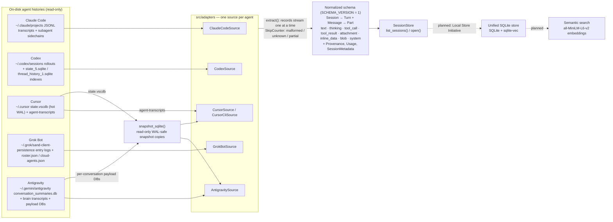
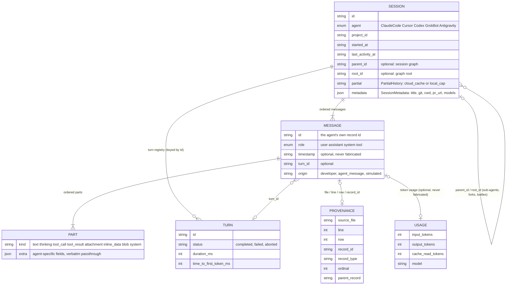
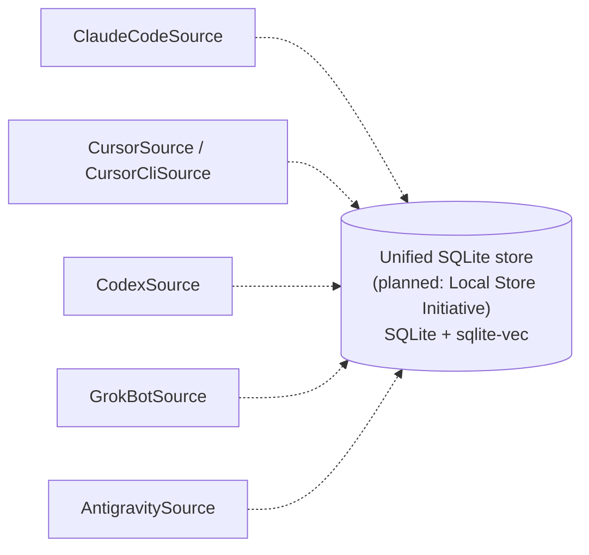
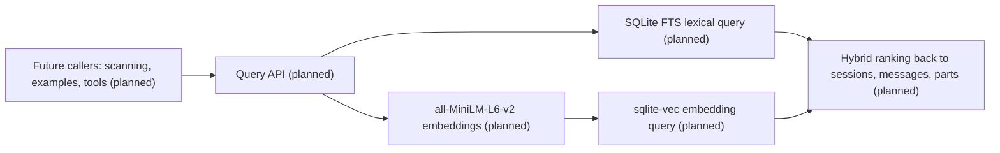

# BotSpy design narrative and FAQ

This page preserves the project's original narrative — the pre-release
press release and the detailed FAQ with the architecture and schema
diagrams — which used to live in `README.md`. The user-facing README is
now a shorter how-to; this page keeps the background story.

Note: this narrative was written while the Local Store Initiative was
still landing, so items marked "planned" in the diagrams below were in
flight at the time of writing. The CLI verbs that actually shipped are
the ones documented in the current `README.md` (`sources`, `sessions`,
`show`, `doctor`, `snapshot`).

## Press release

### BotSpy opens every coding agent's conversation history with one library

*Every AI coding agent's conversation history — Claude Code, Cursor, Codex, Grok Bot, and Antigravity — in one read-only, searchable store.*

BotSpy pops open the conversation history of any coding agent: one adapter
per agent (Claude Code, Cursor, Codex, Grok Bot, Antigravity, more later),
one standard normalized schema, and one unified agent-session history.

The product is the `botspy` Rust **library crate** plus its `botspy` CLI —
no server, no C API/FFI. Metrics live in `examples/` as consumers of the
public API, never in the library: a coding-session thanks-vs-F-bombs meter
(`examples/meter`), local sentiment analysis with a VADER-style lexicon
(`examples/sentiment`), and a stub showing where further session metrics
would go (`examples/metrics_stub`).

### The problem

Every coding agent keeps its history on disk in its own format and its own
place: append-only JSONL transcripts, hot SQLite stores in WAL mode,
hash-named blob logs, protobuf payload databases. The histories are large
(single transcripts exceed 100 MB; the storage survey measured 1.4 GB
Claude Code trees and 6 GB Cursor stores) and they mutate while you read
them. Each agent's own history view is per-agent and ephemeral, so there is
no way to ask "what did the agents do to this repo" across all of them.

### The solution

One typed adapter per agent taps its source read-only: records stream out
one at a time, malformed lines and unknown record types are skipped and
counted — never fatal — and hot SQLite stores are read through safe
snapshot copies. Everything normalizes into one schema where sessions,
turns, messages, typed parts, and per-record provenance look the same no
matter which agent produced them. A unified SQLite store with query and
semantic search over every agent's history rounds out the mission.



> "We run Claude Code, Cursor, and Codex on the same repos every day. I
> want to ask 'what did the agents do last week' once, across all of them —
> without opening five different history views, and without anything
> touching my logs. BotSpy reads them all in one shape and never writes a
> byte."
>
> — a hypothetical platform engineer on a multi-agent team

BotSpy is deliberately small and self-contained. It does one job — bring
every coding agent's session history into one central store — and does it
well. What grows is what gets built on top: your apps, dashboards, and
analyses, not the library.

## FAQ

### Why not just read each agent's files directly?

You can — once. Five formats that all mutate under you: append-only JSONL
with subagent sidechains and auxiliary records (Claude Code), a hot WAL KV
store with content-addressed blobs and unordered bubble keys (Cursor),
rollouts whose authoritative order is an explicit ordinal plus two SQLite
indexes (Codex), entry-log blobs capped at 200 entries with roster
attribution (Grok Bot), and a summaries index linked to per-conversation
payload DBs (Antigravity). Each needs its own ordering rule, role mapping,
resume logic, and tolerance for malformed input. BotSpy's typed adapter
protocol solves this once per agent behind specs — see
[`features/03_importers/README.md`](../features/03_importers/README.md) for
the protocol and how to extend it.

### Is it safe? Will it touch my agent data?

No. Adapters are read-only by construction — the protocol has no surface
for writing to a source. SQLite sources in WAL mode (a live app writing
while you read) are read through `snapshot_sqlite()`: a snapshot copy taken
over a read-only connection via SQLite's online backup API, so the source
file, WAL, and shm are never written and the live writer never blocks.
Both behaviors are pinned by implemented specs:
[`contract.feature`](../features/03_importers/contract.feature) and
[`wal_snapshot.feature`](../features/03_importers/wal_snapshot.feature).

### Where does my data go? Is it private?

Nowhere. The library reads local files and returns in-memory values; there
is no network, no telemetry, no server. The planned unified store is a
local SQLite file, and the planned semantic search runs local embeddings
(all-MiniLM-L6-v2 on CPU) — nothing leaves the machine.

### Which agents are supported?

All five sources are built today — discovery, streaming extraction, skip
counters, and doctor diagnostics for each:

- `adapters::claude_code::ClaudeCodeSource` — JSONL transcripts under `~/.claude/projects`
- `adapters::cursor::{CursorSource, CursorCliSource}` — the `state.vscdb` KV store (via snapshot) plus CLI agent transcripts
- `adapters::codex::CodexSource` — rollout JSONL plus `state_5.sqlite` / `thread_history_1.sqlite` indexes
- `adapters::grok_bot::GrokBotSource` — `sand-client-persistence` entry logs, roster, and cloud-agent stubs
- `adapters::antigravity::AntigravitySource` — the summaries index, brain transcripts, and payload DBs (via snapshot)

"More later" is by design — adding an agent is a bounded job (see the
importers README).

### What does the normalized schema look like?



Sessions hold ordered messages; messages hold ordered typed parts; turn
facts live on `Turn`, not on messages; every record keeps `Provenance`
back to the exact file, line, or row and the agent's own record id; and
timestamps are optional and never fabricated. Anything the schema does not
model yet passes through verbatim (`Part::Extra` and each part's `extra`).
`SCHEMA_VERSION` is 1; the full spec is
[`features/01_structure/`](../features/01_structure/).

### How is this different from each agent's own history view?

In-app history is per-agent, ephemeral, and unqueryable from outside, and
every agent hands you its records in its own shape. BotSpy gives every
agent's records the same shape, losslessly — agent-specific part kinds
degrade verbatim to `Part::Extra`, agent-specific fields ride along in
`extra`, and provenance points back to the source — so one query covers
all of them.

### How big do the stores get, and how is that handled?

The storage survey measured 1.4 GB Claude Code trees and 6 GB Cursor
stores; single transcripts exceed 100 MB. Nothing is loaded whole:
extraction streams one `RawRecord` at a time with bounded memory
(`peak_buffered`), append-only transcripts resume from byte offsets, and
discovery is incremental by identity. The planned query engine exists
precisely so callers never hold every record in memory to filter.

### What happens when the agents change their formats?

Nothing is fatal and nothing is lost. Malformed lines and unknown record
types are skipped and counted (`SkipCounter`: malformed / unknown /
partial), never errors. Unknown part kinds and agent-specific fields pass
through verbatim (`Part::Extra`, `extra`). The schema is versioned
(`SCHEMA_VERSION`), and provenance keeps the agent's own record ids and
types for re-extraction.

### How do I use BotSpy from the command line?

The `botspy` CLI fronts the library. Everyday use:

- `botspy sessions` — list sessions across every agent, most recent
  activity first (`--source`, `--project`, time-window filters)
- `botspy show <session-id>` — open one session and walk its messages,
  parts, turns, and provenance
- `botspy search "text"` — find sessions and messages across the store

Keeping the store current:

- `botspy import` — mine every registered source into the local store
- `botspy watch` — keep mining as agents append, in the background
- `botspy snapshot <db>` — take a read-only, WAL-safe snapshot of a live
  SQLite source

Diagnostics:

- `botspy sources` — the source adapters and where each one reads
- `botspy doctor` — per-source diagnostics: what was found, what was
  skipped, and why
- `botspy stats` — usage, cost, and activity across the store

For example: `botspy sessions --source cursor --project botspy`, or
`botspy search "compaction" --source claude-code`.

Note: when this was written, `search`, `import`, `watch`, and `stats`
were planned verbs. The verbs that shipped in the CLI are `sources`,
`sessions`, `show`, `doctor`, and `snapshot` — see `README.md`.

### What can I build on top of BotSpy?

Anything that needs agent history. The library is a dependency you drop
into an app; the CLI answers quick questions from the terminal. The
example consumers in `examples/` show the shape — the thanks-vs-F-bombs
meter, sentiment analysis, and a metrics stub: analyses built on the
public API, never part of it. Dashboards, retro tools, report generators:
same store, same shape, your app.

### How do I add a sixth agent?

Implement one source with the same `discover()` / `extract()` shape as the
five, strictly read-only, mapping records onto the chapter-1 schema — then
spec it with synthetic fixtures under `features/03_importers/<agent>/`.
The protocol, step by step, with a class diagram:
[`features/03_importers/README.md`](../features/03_importers/README.md).

### What is the status of the unified store, querying, and semantic search?

Planned, specified, not built. The Local Store Initiative (BOTSPY-c7795b
on the Kanbus board) is one local SQLite file (WAL mode) with the
sqlite-vec extension for similarity search; the query interface is
specified in [`features/02_querying/`](../features/02_querying/) (iteration,
filters by source / project / part kind / time window, laziness — all
`@wip` until it lands). All five sources are built; the store and the
wiring into it are planned — every adapter converges into one store:



Over it, one query path — lexical and semantic, hybrid-ranked back to
sessions, messages, and parts:



### How do I run the tests? How do I develop it?

The fastest library tour is the doctest drill-down in `lib.rs` (build a
`SessionStore`, register a `FixtureAdapter`, list and open sessions); the
fastest CLI tour is `botspy doctor`. Tests and lint:

```bash
cargo test              # unit tests + the bdd (Gherkin) suite
cargo test --test bdd   # only the Gherkin specs
cargo clippy --all-targets -- -D warnings
cargo fmt --all --check
```

The spec-first workflow behind those commands is described in the last
section, [The spec-first workflow](#the-spec-first-workflow).

## The spec-first workflow

Specs are the source of truth. BotSpy is a behavior-driven specification
project: the Gherkin behavior specifications under `features/` are the
backbone and the true source of the project; implementation code is
considered generated from the specs. All planning is organized around
features and their specs. Work starts by writing or refining the feature
spec (with concrete examples), then the step definitions (Rust, `cucumber`
crate), then the implementation. Run the specs with `cargo test --test bdd`.

The rustdoc (`cargo doc --open`) is organized the same way, one chapter per
spec layer: structure, querying, and importers.

Task management is Kanbus (see `AGENTS.md` and `CONTRIBUTING_AGENT.md`),
driven by the `kbs` CLI.