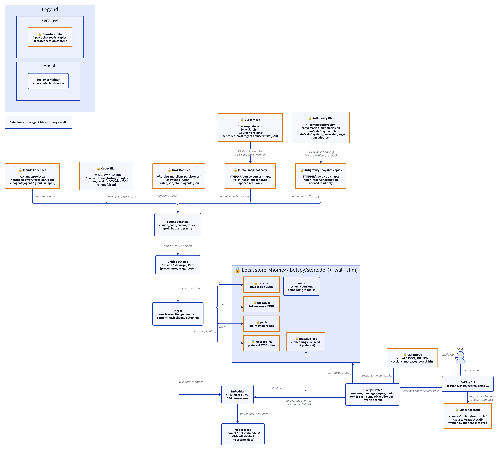

# BotSpy documentation

BotSpy reads the session histories that coding agents write on your
machine — Claude Code, Cursor, Codex, Grok Bot, and Antigravity — and
stores them in one local SQLite store. The store gives you one unified
listing, full-text search, and semantic search over all of them.

A central part of that purpose is **sensitive-data visibility**: your
agent sessions contain prompts, code, tool output, and sometimes
secrets. BotSpy never hides where that data lives. Every diagram in
this documentation marks sensitive places with the same amber border
and lock icon, and [`sensitive-data.md`](sensitive-data.md) lists every
path BotSpy reads, copies, or writes.

## Reading order

| Document | What it covers |
| --- | --- |
| [`architecture.md`](architecture.md) | The C4 views (context, containers, components) and the top-level data flow, from agent files to query results. |
| [`cli.md`](cli.md) | The `botspy` command: every verb, flag, output mode, and exit code. |
| [`store.md`](store.md) | The local store: where it lives, its tables, ingest, and incremental refresh. |
| [`search.md`](search.md) | Text search, semantic search, hybrid search, the embedding model, and the one-time model download. |
| [`sensitive-data.md`](sensitive-data.md) | The sensitive-data inventory: every exact path, in every category. |
| [`sources/`](sources/) | One document per source adapter, plus the shared adapter protocol. |
| [`diagrams.md`](diagrams.md) | How to update and re-render the diagrams, and where the shared theme lives. |

## The diagrams

All diagrams are [D2](https://d2lang.com) sources under
[`diagrams/`](diagrams/). One command re-renders every diagram:

```bash
scripts/render-diagrams.sh
```

Each diagram renders as an SVG and as two PNGs, one for light mode and
one for dark mode. The pages below embed both, and GitHub picks the one
that matches your color scheme:

<picture>
  <source media="(prefers-color-scheme: dark)" srcset="diagrams/dataflow.dark.png">
  
</picture>

See [`diagrams.md`](diagrams.md) for the render pipeline, the pinned
tool versions, and the shared theme.