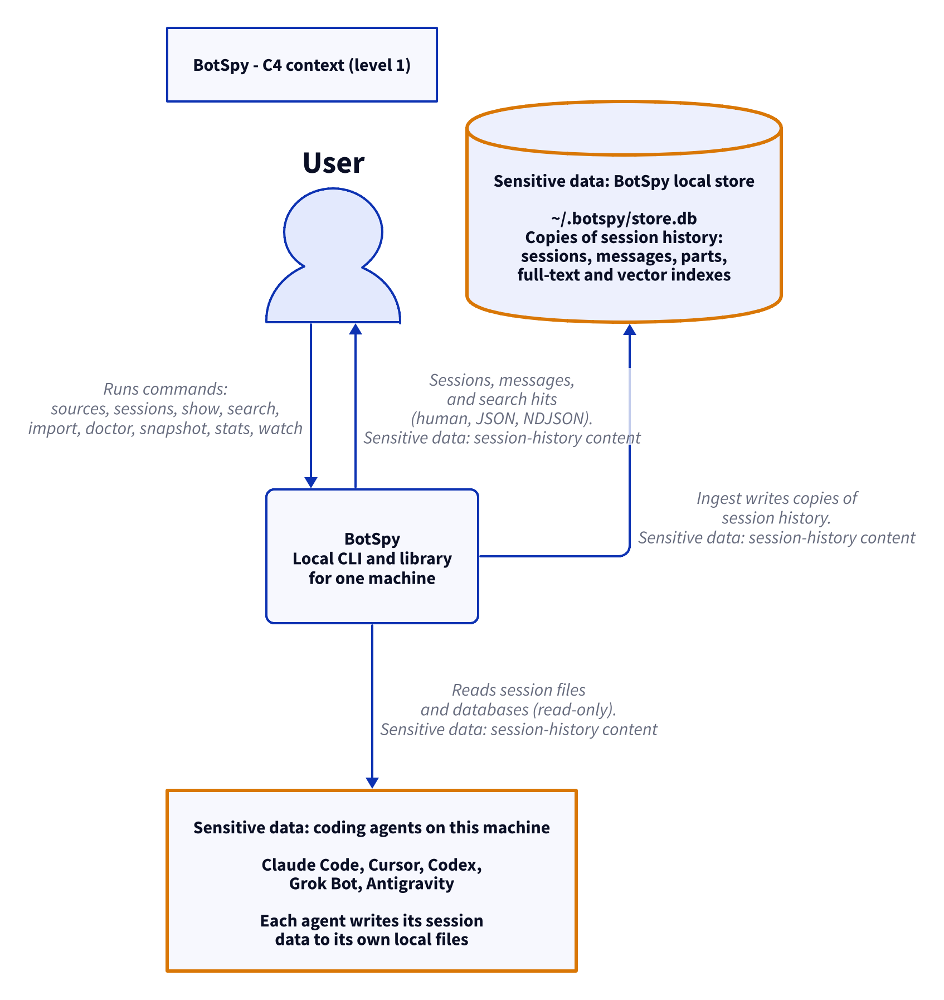
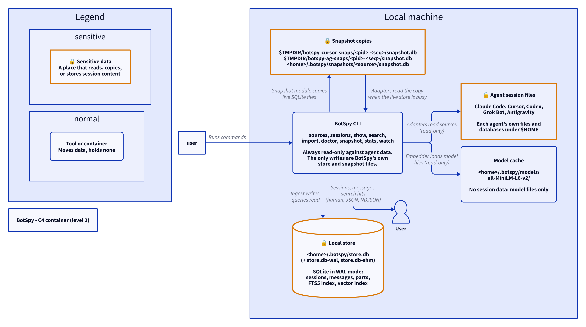
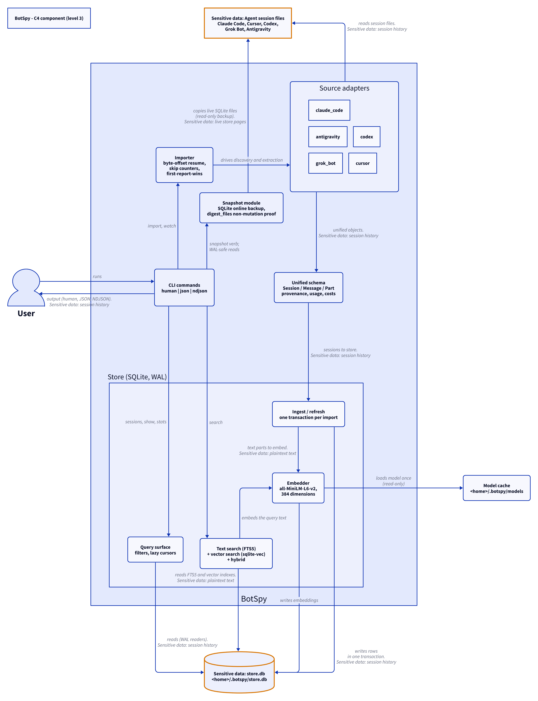

# Architecture

BotSpy is a local CLI and library. It reads the session data that five
coding agents write on your machine, converts that data into one
unified schema, and stores it in one local SQLite store. You query the
store through the CLI.

BotSpy never writes to the agents' own files. It reads them. The only
files BotSpy writes are its own store, its snapshot copies, and its
model cache.

Sensitive-data note: every diagram below marks places that read, copy,
or store session content with the amber 🔒 border. The full inventory
of those places, with exact paths, is in
[`sensitive-data.md`](sensitive-data.md).

## C4 level 1 — context

The system in one picture: you run commands, BotSpy reads agent data
read-only, and BotSpy shows you the results.

<picture>
  <source media="(prefers-color-scheme: dark)" srcset="diagrams/context.dark.png">
  
</picture>

## C4 level 2 — containers

On one machine there are four data places and one process:

- The **agent session files** — the five agents' own files, read-only.
- The **snapshot copies** — SQLite copies BotSpy makes when it must
  read a live database safely.
- The **local store** — `<home>/.botspy/store.db`, BotSpy's own SQLite
  database (WAL mode), holding sessions, messages, parts, a full-text
  index, and a vector index.
- The **model cache** — `<home>/.botspy/models/`, model files only, no
  session data.
- The **BotSpy CLI** — the one process. It is a thin shell over the
  library. It holds no data of its own.

<picture>
  <source media="(prefers-color-scheme: dark)" srcset="diagrams/containers.dark.png">
  
</picture>

## C4 level 3 — components

Inside BotSpy:

- **CLI commands** — flags, exit codes, rendering.
- **Source adapters** — one per agent: `claude_code`, `cursor`,
  `codex`, `grok_bot`, `antigravity`. Each adapter knows its agent's
  file formats and record types.
- **Snapshot module** — SQLite online backup over a read-only
  connection, with digest proof that the source did not change.
- **Importer** — drives discovery and extraction; resumes at byte
  offsets; counts skips.
- **Unified schema** — `Session`, `Message`, `Part`, with provenance,
  usage, and costs.
- **Store** — ingest/refresh, the query surface, text search (FTS5),
  vector search (sqlite-vec), and the embedder (all-MiniLM-L6-v2).

<picture>
  <source media="(prefers-color-scheme: dark)" srcset="diagrams/components.dark.png">
  
</picture>

## The data flow, end to end

The flow has five stages. The diagram shows all of them with exact
paths; the text below walks the same path.

<picture>
  <source media="(prefers-color-scheme: dark)" srcset="diagrams/dataflow.dark.png">
  
</picture>

### 1. Read

Each adapter reads its agent's own files. The paths:

- Claude Code: `~/.claude/projects/<encoded-cwd>/<session>.jsonl`
- Cursor: `~/.cursor/state.vscdb` and
  `~/.cursor/projects/<encoded-cwd>/agent-transcripts/*.jsonl`
- Codex: `~/.codex/state_5.sqlite` and
  `~/.codex/sessions/YYYY/MM/DD/rollout-*.jsonl`
- Grok Bot: `~/.grok/sand-client-persistence/*.json`
- Antigravity: `~/.gemini/antigravity/conversation_summaries.db`,
  `brain/<id>/payload.db`, and
  `brain/<id>/.system_generated/logs/transcript.jsonl`

When an agent's database is live and busy (Cursor's and Antigravity's
SQLite files), the adapter first copies it with the snapshot module,
then reads the copy. The copies land in `$TMPDIR` under
`botspy-cursor-snaps/<pid>-<seq>/` and `botspy-ag-snaps/<pid>-<seq>/`.
The `snapshot` verb writes its copies to
`<home>/.botspy/snapshots/<source>/snapshot.db`. The snapshot module
proves with file digests that the source files did not change.

### 2. Convert

Each adapter converts its agent's records into the unified schema:
`Session`, `Message`, `Part`. Each part keeps provenance (source file,
line or row, record id and type). Each adapter has one authoritative
order key — Claude Code uses line order, Cursor uses the bubble order
from `composerData`, Codex uses the `ordinal` field, Grok Bot uses
`seq`, Antigravity uses `step_index`. Records the adapter does not know
are skipped and counted, never fatal. One document per adapter, in
increasing detail, lives in [`sources/`](sources/).

### 3. Ingest

`Store::ingest` writes sessions in one transaction per import. The
content hash (SHA-256 over the session JSON) detects change. A changed
session is deleted and written again; its FTS rows are re-indexed and
its vectors re-embedded. The first report wins when two sources claim
the same `(agent, id, project)` session.

### 4. Store

Everything lands in `<home>/.botspy/store.db` (WAL mode, sidecars
`store.db-wal` and `store.db-shm`):

- `sessions`, `messages`, `parts` — projected columns plus the lossless
  JSON of each record. `parts.text` is plaintext.
- `message_fts` — an FTS5 index over the part text. Plaintext.
- `message_vec` / `message_vec_rows` — the vector index. Embeddings are
  derived data, not plaintext.
- `meta` — schema version and the embedding model id.

### 5. Query

The query surface reads the store with separate WAL reader connections,
so queries run while ingest commits. Search runs as FTS5 text search,
sqlite-vec semantic search, or the hybrid fusion of both. The CLI
renders the result as human text, JSON, or NDJSON on stdout.

## Where the data ends up

After an import, a copy of every session exists in exactly three kinds
of place: the agents' own files (untouched), BotSpy's snapshot copies
(temporary), and BotSpy's store. The store is the only place BotSpy
keeps long term. Delete `<home>/.botspy/` and no BotSpy copy of your
sessions remains. See [`sensitive-data.md`](sensitive-data.md).