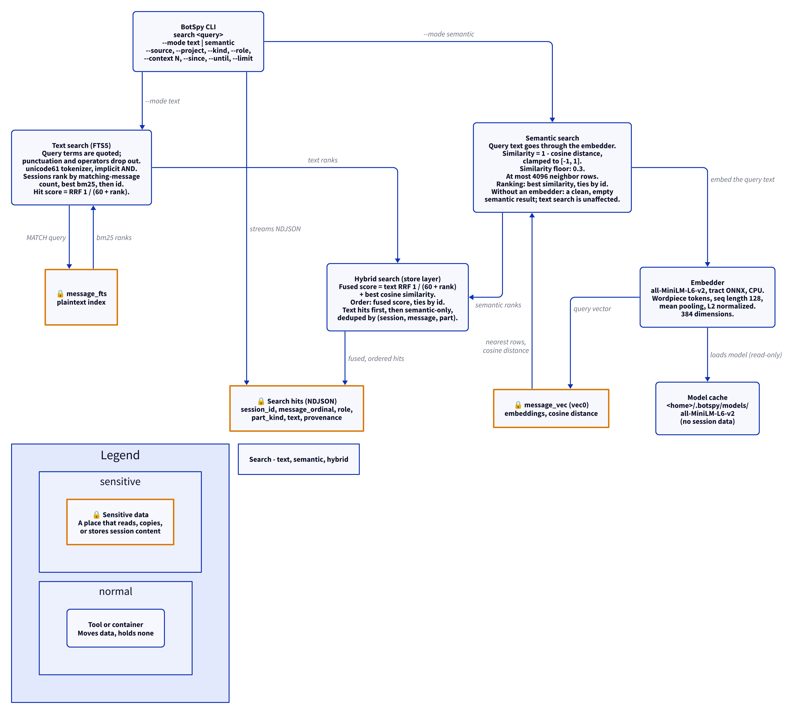
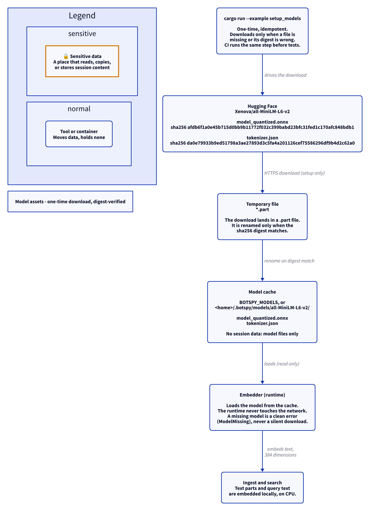

# Search: text, semantic, hybrid

This document uses Simplified Technical English.

The store gives three search modes over the same data:

- Text search — FTS5 over the plaintext part text.
- Semantic search — cosine similarity over the embeddings.
- Hybrid search — both result sets fused into one ranking.

## Text search

1. The query is sanitized: the terms are quoted, and the punctuation
   and the operators drop out. This prevents FTS injection.
2. The tokenizer is `unicode61`. The terms combine with an implicit
   AND.
3. The sessions rank by matching-message count, then by the best bm25
   score, then by id.
4. Each hit gets the score `1 / (60 + rank)` — its share of the
   reciprocal-rank fusion.
5. A hit gives: session id, message ordinal, part ordinal, text, and
   score.
6. A query with no match gives an empty result.

## The embedder

The `Embedder` trait has three parts: `model_id`, `dim`, and `embed`.

The shipped embedder is `MiniLMEmbedder`:

- The model is all-MiniLM-L6-v2, quantized, run with tract ONNX on the
  CPU.
- The tokenizer is wordpiece, from the `tokenizers` crate. The sequence
  length is 128. Longer text is cut; shorter text is padded.
- The pooling is mean pooling over the attention mask.
- The output is L2-normalized. The dimension is 384.
- The model id is "all-MiniLM-L6-v2".

The store records the model id in `meta` on the first embed. A later
ingest with a different model is refused, even when the ingest changes
nothing. See [`store.md`](store.md).

## Semantic search

1. The query text goes through the embedder. The query text is
   sensitive: it can hold anything.
2. The vector index is the vec0 table `message_vec`. The distance
   metric is cosine.
3. The similarity is `1 - distance`, clamped to the range [-1, 1].
4. Rows below the similarity floor 0.3 are dropped.
5. At most 4096 neighbor rows are taken.
6. The sessions rank by the best similarity, then by id. The limit `k`
   caps the sessions.
7. Without an embedder, the semantic result is clean and empty. The
   text search is not affected.

## Hybrid search

1. The text result and the semantic result are fused.
2. The fused score is the text RRF share `1 / (60 + rank)` plus the
   best cosine similarity.
3. The hits order by fused score; ties break by id.
4. The text hits come first per session, then the semantic-only hits.
5. The result is deduplicated by (session, message, part).

## The model assets

The model is not in the repository. A setup step downloads it once.

1. Run `cargo run --example setup_models`.
2. The step is idempotent. It downloads only when a file is missing or
   its digest is wrong.
3. The files come from
   `https://huggingface.co/Xenova/all-MiniLM-L6-v2/resolve/main/onnx/model_quantized.onnx`
   and
   `https://huggingface.co/Xenova/all-MiniLM-L6-v2/resolve/main/tokenizer.json`.
4. Each file has a pinned SHA-256 digest:
   - `model_quantized.onnx`:
     `afdb6f1a0e45b715d0bb9b11772f032c399babd23bfc31fed1c170afc848bdb1`
   - `tokenizer.json`:
     `da0e79933b9ed51798a3ae27893d3c5fa4a201126cef75586296df9b4d2c62a0`
5. Each download lands in a `.part` file. The file is renamed only when
   the digest matches.
6. The files land in the cache: `BOTSPY_MODELS`, or
   `<home>/.botspy/models/all-MiniLM-L6-v2/`.
7. CI runs the same step before the tests, with the cache at
   `.botspy-models`.

The runtime never touches the network. A missing model gives the clean
error `ModelMissing` — never a silent download.

The model cache holds model files only. It holds no session data.

## The search diagram

<picture>
  <source media="(prefers-color-scheme: dark)" srcset="diagrams/search.dark.png">
  
</picture>

## The model-assets diagram

<picture>
  <source media="(prefers-color-scheme: dark)" srcset="diagrams/model-assets.dark.png">
  
</picture>