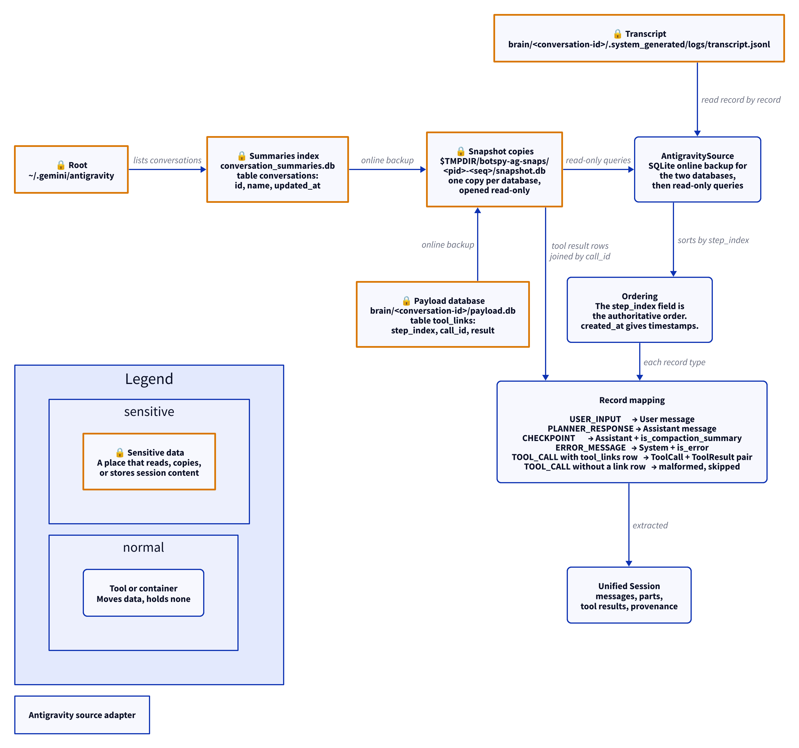

# Antigravity source adapter

This document uses Simplified Technical English.

The Antigravity adapter reads the conversation index and the per-
conversation files under `~/.gemini/antigravity`.

## Where the data lives

| Path | Content |
| --- | --- |
| `~/.gemini/antigravity/conversation_summaries.db` | The summaries index. The table `conversations` gives: `id`, `name`, `updated_at`. |
| `~/.gemini/antigravity/brain/<conversation-id>/.system_generated/logs/transcript.jsonl` | The transcript. One JSON record per line. |
| `~/.gemini/antigravity/brain/<conversation-id>/payload.db` | The payload database. The table `tool_links` gives: `step_index`, `call_id`, `result`. |

## The snapshots

1. The two databases are live: Antigravity writes to them.
2. The adapter copies each one with the SQLite online backup API.
3. The copies land at `$TMPDIR/botspy-ag-snaps/<pid>-<seq>/snapshot.db`.
4. The copies open read-only. The live databases are never written to.
5. `digest_files` proves that the sources were not mutated.

## Discovery

`AntigravityDiscovery` gives the conversation count from the summaries
index.

## Extraction and ordering

1. The transcript is read record by record.
2. The `step_index` field, not the file order, is the authoritative
   order. The adapter sorts by `step_index`.
3. The `created_at` fields give the timestamps. A missing time stays
   missing.

## Record mapping

| Record type | Unified result |
| --- | --- |
| `USER_INPUT` | A User message |
| `PLANNER_RESPONSE` | An Assistant message |
| `CHECKPOINT` | An Assistant message with `is_compaction_summary` |
| `ERROR_MESSAGE` | A System message with `is_error` |
| `TOOL_CALL` with a `tool_links` row | A `ToolCall` part and a `ToolResult` part, joined by `call_id` |
| `TOOL_CALL` without a link row | Malformed. Skipped and counted |

## Report

`AntigravityReport` gives: the root, the conversation count, the
transcripts, and the issues.

## The diagram

<picture>
  <source media="(prefers-color-scheme: dark)" srcset="../diagrams/antigravity.dark.png">
  
</picture>

## Sensitive data

The adapter reads session content: user input, planner responses,
checkpoints, error text, and tool results. Exact paths:

- `~/.gemini/antigravity/conversation_summaries.db` — read through a
  snapshot copy
- `~/.gemini/antigravity/brain/<conversation-id>/payload.db` — read
  through a snapshot copy
- `~/.gemini/antigravity/brain/<conversation-id>/.system_generated/logs/transcript.jsonl` — read
- `$TMPDIR/botspy-ag-snaps/<pid>-<seq>/snapshot.db` — BotSpy's copies

See [`../sensitive-data.md`](../sensitive-data.md).