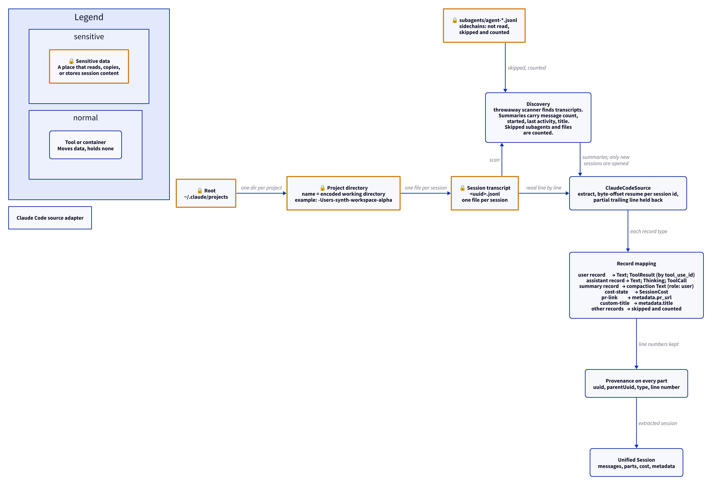

# Claude Code source adapter

This document uses Simplified Technical English.

The Claude Code adapter reads the transcripts that Claude Code writes
under `~/.claude/projects`. One directory holds one project. One
JSONL file holds one session.

## Where the data lives

| Path | Content |
| --- | --- |
| `~/.claude/projects/<encoded-cwd>/` | One directory per project. The directory name is the encoded working directory. Example: `-Users-synth-workspace-alpha`. |
| `<dir>/<uuid>.jsonl` | One file per session. One JSON record per line. |
| `<dir>/subagents/agent-*.jsonl` | Sidechain transcripts from subagents. |

## Discovery

1. A throwaway scanner walks the project directories.
2. It finds each `*.jsonl` transcript.
3. It gives a summary per transcript: message count, started time,
   last activity, and title.
4. It does not open the files for extraction. Only new sessions are
   opened later.
5. `ClaudeDiscovery` gives the counts: `transcripts`,
   `skipped_subagents`, `skipped_files`.

The subagent sidechain files are not read. They are skipped and
counted.

## Extraction

1. `ClaudeCodeSource` reads the transcript line by line.
2. It keeps a byte offset per session id. The next run resumes at the
   offset.
3. A partial trailing line — Claude Code still writing — is held back
   until the line is complete.
4. Each part keeps provenance: the record uuid, the parent uuid, the
   type, and the line number.

## Record mapping

| Record type | Unified result |
| --- | --- |
| `user` (string content) | A `Text` part |
| `user` (array content) | A `Text` part plus `ToolResult` parts, matched by `tool_use_id` from the tool call |
| `assistant` (array content) | `Text`, `Thinking` (with signature), and `ToolCall` parts (id, name, parsed input) |
| `summary` | A compaction `Text` part on a user-role message |
| `cost-state` | `SessionCost`: total cost in USD, API duration, tool duration, lines added and removed |
| `pr-link` | `metadata.pr_url` |
| `custom-title` | `metadata.title` |
| other (example: `file-history-snapshot`) | Skipped and counted |

## Report

`ClaudeReport` gives: the root, the project directories, the
transcripts, the skipped subagents, the skipped files, and the issues.

## The diagram

<picture>
  <source media="(prefers-color-scheme: dark)" srcset="../diagrams/claude-code.dark.png">
  
</picture>

## Sensitive data

The adapter reads session content: prompts, code, thinking traces,
tool output, and costs. Exact paths:

- `~/.claude/projects/<encoded-cwd>/<uuid>.jsonl` — read
- `~/.claude/projects/<encoded-cwd>/subagents/agent-*.jsonl` —
  skipped and counted

The content flows on to the unified schema and into the local store.
See [`../sensitive-data.md`](../sensitive-data.md).