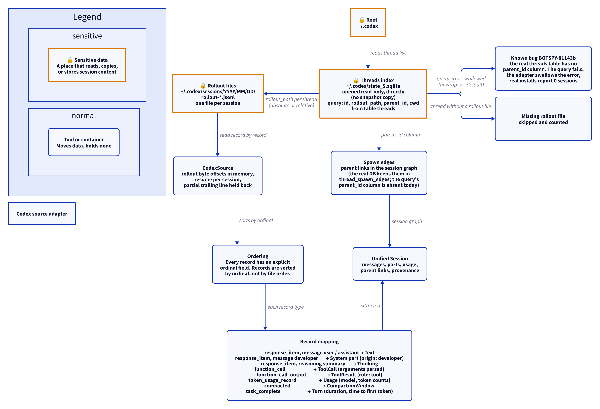

# Codex source adapter

This document uses Simplified Technical English.

The Codex adapter reads the thread index and the rollout files that
Codex keeps under `~/.codex`. The reference registry
(`create_source`) roots Codex at `~/.codex/sessions`; the CLI roots
the adapter at `~/.codex`, where `state_5.sqlite` lives.

## Where the data lives

| Path | Content |
| --- | --- |
| `~/.codex/state_5.sqlite` | The threads index. The adapter opens the database read-only, directly — not through a snapshot copy. The query selects `id`, `rollout_path`, `parent_id`, `cwd` from the table `threads`. |
| `~/.codex/sessions/YYYY/MM/DD/rollout-*.jsonl` | The rollouts. One file holds one session. |

The adapter never opens `~/.codex/thread_history_1.sqlite`. The
rollout byte offsets live in memory, inside the `CodexSource` process
(`set_offset` seeds one by hand, as that index would have recorded
it). A process restart loses the offsets.

## A known bug: 0 sessions on real installs

The `threads` query expects a `parent_id` column. The real Codex
database does not have that column (spawn edges live in the table
`thread_spawn_edges`). The query fails, the adapter swallows the
error (`unwrap_or_default`), and discovery silently reports 0
sessions on real installs. Open Kanbus bug BOTSPY-81143b tracks the
fix: read the spawn edges, surface a schema mismatch as a doctor
issue, and stop swallowing the error.

## Discovery

1. The adapter opens `state_5.sqlite` read-only and reads the
   `threads` table.
2. Each thread gives its rollout path. The path may be absolute or
   relative to the root.
3. A thread with a missing rollout file is skipped and counted.
4. `parent_id` links become `parent_links` in the session graph. On
   real installs this step never runs today; see the bug above.
5. `CodexDiscovery` gives: the thread count, the missing rollouts, and
   the parent links.

## Extraction and ordering

1. `CodexSource` reads the rollout record by record.
2. Every record carries an explicit `ordinal` field. The ordinal, not
   the file order, is the authoritative order. The adapter sorts by
   ordinal.
3. The adapter keeps a byte offset per session, in memory. The next
   run in the same process resumes at the offset.
4. A partial trailing line is held back until it is complete.

## Record mapping

| Record type | Unified result |
| --- | --- |
| `response_item`, payload message user / assistant | A `Text` part |
| `response_item`, payload message developer | A `System` part with origin developer |
| `response_item`, reasoning summary | A `Thinking` part |
| `function_call` | A `ToolCall` part (call id, name, parsed arguments) |
| `function_call_output` | A `ToolResult` part on a tool-role message |
| `token_usage_record` | Session `Usage`: input, output, cached input, reasoning tokens, and the model |
| `compacted` | A `CompactionWindow`: window id, previous window, retained context |
| `task_complete` | A `Turn`: turn id, duration, time to first token |

## Report

`CodexReport` gives: the root, the thread count, the missing rollouts,
and the issues.

## The diagram

<picture>
  <source media="(prefers-color-scheme: dark)" srcset="../diagrams/codex.dark.png">
  
</picture>

## Sensitive data

The adapter reads session content: prompts, replies, reasoning
summaries, tool calls and output, and token usage. Exact paths:

- `~/.codex/state_5.sqlite` — read
- `~/.codex/sessions/YYYY/MM/DD/rollout-*.jsonl` — read

See [`../sensitive-data.md`](../sensitive-data.md).