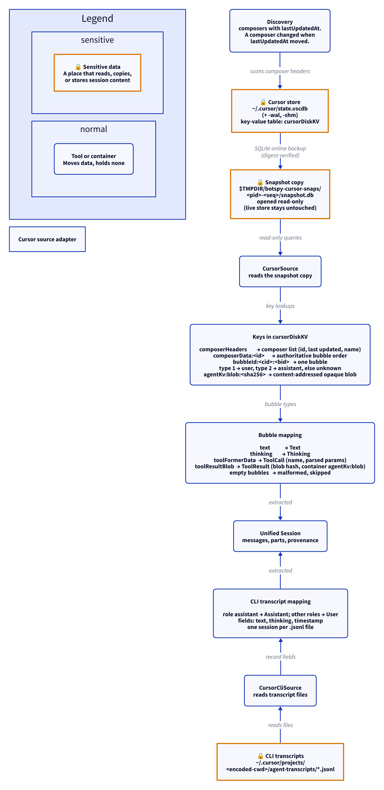

# Cursor source adapter

This document uses Simplified Technical English.

Cursor keeps conversations in two places: the IDE store (a SQLite
key-value database) and the CLI transcripts (JSONL files). BotSpy has
one adapter for each place.

## Where the data lives

| Path | Content |
| --- | --- |
| `~/.cursor/state.vscdb` (plus `-wal`, `-shm`) | The IDE store. One table, `cursorDiskKV(key, value)`, holds everything. |
| `~/.cursor/projects/<encoded-cwd>/agent-transcripts/*.jsonl` | The CLI transcripts. One file per session. |

## The snapshot

1. The live store is busy: Cursor writes to it.
2. The adapter copies it with the SQLite online backup API.
3. The copy lands at `$TMPDIR/botspy-cursor-snaps/<pid>-<seq>/snapshot.db`.
4. The copy opens read-only. The live store is never written to.
5. `digest_files` proves that the source was not mutated.

## The keys in `cursorDiskKV`

| Key | Value |
| --- | --- |
| `composerHeaders` | The composer list: composer id, last update time, name |
| `composerData:<id>` | The composer data. `fullConversationHeadersOnly` gives the authoritative bubble order |
| `bubbleId:<composerId>:<bubbleId>` | One bubble. Type 1 is user, type 2 is assistant, other types are unknown |
| `agentKv:blob:<sha256>` | A content-addressed opaque blob |

## Bubble mapping

| Bubble field | Unified result |
| --- | --- |
| `text` | A `Text` part |
| `thinking` | A `Thinking` part |
| `toolFormerData` | A `ToolCall` part (name, parsed params) |
| `toolResultBlob` | A `ToolResult` part (blob hash, container `agentKv:blob`) |
| empty bubble | Malformed. Skipped and counted |

## CLI transcripts

1. One `agent-transcripts/*.jsonl` file is one session.
2. Each record gives role, text, thinking, and timestamp.
3. The role `assistant` maps to an Assistant message. Other roles map
   to User messages.

## Discovery

`CursorDiscovery` gives the composer count and a change flag. A
composer changed when its `lastUpdatedAt` moved. Only changed
composers are extracted again.

## Report

`CursorReport` gives: the store path, the composer count, the bubble
count, and the issues.

## The diagram

<picture>
  <source media="(prefers-color-scheme: dark)" srcset="../diagrams/cursor.dark.png">
  
</picture>

## Sensitive data

The adapter reads session content: composer conversations, prompts,
replies, thinking traces, tool blobs. Exact paths:

- `~/.cursor/state.vscdb` (plus `-wal`, `-shm`) — read through the
  snapshot copy
- `$TMPDIR/botspy-cursor-snaps/<pid>-<seq>/snapshot.db` — BotSpy's
  copy of the store
- `~/.cursor/projects/<encoded-cwd>/agent-transcripts/*.jsonl` — read

See [`../sensitive-data.md`](../sensitive-data.md).