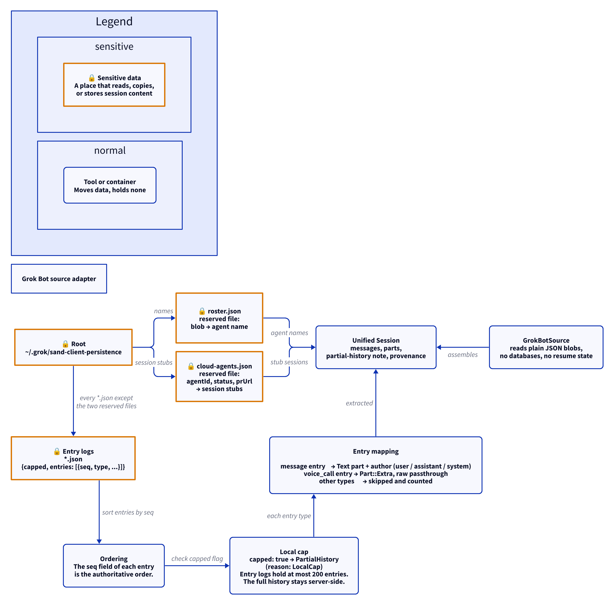

# Grok Bot source adapter

This document uses Simplified Technical English.

The Grok Bot adapter reads the plain JSON blobs that the Grok desktop
bot keeps under `~/.grok/sand-client-persistence`. There is no
database and there is no resume state: each run reads the blobs again.

## Where the data lives

| Path | Content |
| --- | --- |
| `~/.grok/sand-client-persistence/*.json` | The entry logs. Each log gives `{capped, entries: [{seq, type, ...}]}`. |
| `~/.grok/sand-client-persistence/roster.json` | Reserved. It maps a blob to an agent name. |
| `~/.grok/sand-client-persistence/cloud-agents.json` | Reserved. It gives agent id, status, and prUrl. |

Every `*.json` file is an entry log, except the two reserved files.

## Discovery

`GrokDiscovery` gives: the entry log count, the cloud agents, the
attributions, and the cloud agent ids.

## Ordering

Each entry in a log carries a `seq` field. The `seq`, not the file
order, is the authoritative order. The adapter sorts by `seq`.

## The local cap

1. A log sets `capped: true` when the local log is full.
2. The local log holds at most 200 entries.
3. A capped log gives a `PartialHistory` note: reason `LocalCap`,
   detail "entry log capped locally; full history is server-side".
4. The full history stays on the server. BotSpy reads only the local
   files and never touches the network.

## Entry mapping

| Entry type | Unified result |
| --- | --- |
| `message` | A `Text` part with an author: user, assistant, or system |
| `voice_call` | A `Part::Extra` — the raw payload passes through verbatim |
| other types | Skipped and counted |

## Report

`GrokReport` gives: the root, the entry log count, the cloud agents,
and the issues.

## The diagram

<picture>
  <source media="(prefers-color-scheme: dark)" srcset="../diagrams/grok-bot.dark.png">
  
</picture>

## Sensitive data

The adapter reads session content: messages, author names, and voice
call payloads. Exact paths:

- `~/.grok/sand-client-persistence/*.json` (entry logs) — read
- `~/.grok/sand-client-persistence/roster.json` — read
- `~/.grok/sand-client-persistence/cloud-agents.json` — read

See [`../sensitive-data.md`](../sensitive-data.md).