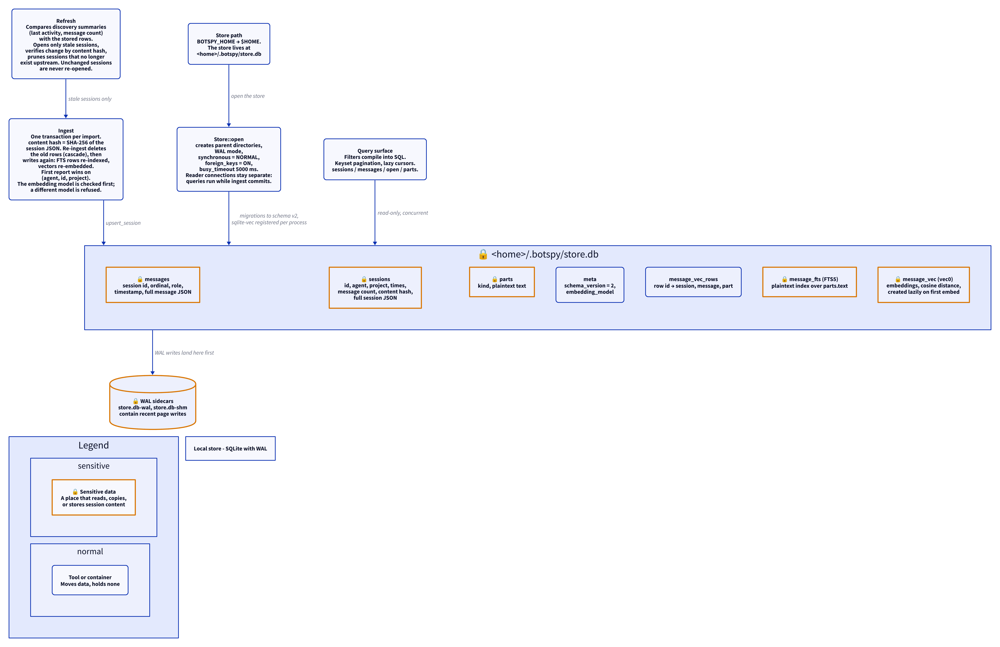

# The local store

This document uses Simplified Technical English. Each sentence gives
one idea. Each section goes one level deeper than the one before it.

The store keeps a copy of every session from every source. The store
is the only place where BotSpy keeps data for a long time.

## Where the store lives

1. The home directory comes from `BOTSPY_HOME`, or from `$HOME`.
2. The store is a file: `<home>/.botspy/store.db`.
3. Two sidecar files hold recent writes: `store.db-wal` and
   `store.db-shm`.

`Store::open(path)` makes the parent directories. You do not create
the store by hand.

## How the store opens

1. `Store::open` puts the database in WAL mode.
2. It sets `synchronous` to `NORMAL`.
3. It sets `foreign_keys` to `ON`.
4. It sets the busy timeout to 5000 ms.
5. It runs the migrations. The `meta` table holds the schema version.
   The current version is 2.
6. It registers sqlite-vec once per process, through
   `sqlite3_auto_extension`. The bundled SQLite ships with FTS5.

Reader connections are separate from the writer connection. WAL mode
lets a reader query the store while ingest commits a transaction.

## What the store holds

| Table | Content |
| --- | --- |
| `sessions` | One row per session: id, agent, project, started and last-activity times, message count, content hash, and the full session JSON. |
| `messages` | One row per message: session id, ordinal, role, timestamp, and the full message JSON. The primary key is (session id, ordinal). |
| `parts` | One row per part: kind and text. The text is plaintext. |
| `message_fts` | An FTS5 index over the part text. The index is plaintext. |
| `message_vec_rows` | Maps each vector row id to its session, message, and part. |
| `message_vec` | A vec0 virtual table with the embeddings. Cosine is the distance metric. The table is made lazily, on the first embed. |
| `meta` | The schema version and the embedding model id. |

Migrations:

- Version 1 makes `sessions`, `messages`, `parts`, the indexes, and
  the FTS5 table.
- Version 2 makes `message_vec_rows` and its index. The vec0 table is
  made on the first embed, because its dimension comes from the
  embedder.

Deletes cascade: a deleted session deletes its messages; a deleted
message deletes its parts. The FTS rows go with the session.

## How ingest works

1. `Store::ingest` takes a list of adapters.
2. It checks the embedding model first. A different model from the one
   in `meta` is refused (`EmbeddingModelMismatch`). The refused ingest
   rolls back and changes nothing.
3. It runs one transaction.
4. For each session it computes the content hash. The hash is SHA-256
   over the JSON of the full session.
5. The first report wins when two sources give the same session
   (agent, id, project).
6. `upsert_session` deletes the old FTS rows, then deletes the session
   and its children. It then writes the projected columns, the JSON
   columns, and the parts.
7. Parts with text also write a row into `message_fts`.
8. If an embedder is set, the vectors are deleted and made again for
   the text parts. The embedded part kinds are: Text, Thinking,
   ToolResult, System.
9. `IngestReport` gives the counts: `new`, `updated`, `unchanged`,
   `pruned`.

## How refresh works

1. `Store::refresh` asks each adapter for its discovery summary.
2. It compares each summary with the stored row: last activity and
   message count.
3. It opens only the stale sessions. An unchanged session is never
   opened again from the adapter.
4. It verifies each change with the content hash.
5. It prunes the sessions that the summary no longer lists.
6. Refresh is idempotent. A second run with the same inputs writes
   nothing.

## How a session comes back

`Store::open_session` reads the `session_json` column and the
`message_json` columns, in ordinal order. It builds the same `Session`
value that the adapter gave to ingest. Nothing is lost.

## How queries work

The query surface is one `Query` type:

- `sessions_with(SessionFilter)` — filter by agent, project, part
  kind, time range, and limit.
- `messages_with(MessageFilter)` — filter by part kind.
- `open` — rebuild one full session.
- `parts` — the parts of a session.

The filters compile into SQL. The engine does the filtering (pushdown).
Cursors use keyset pagination and stay lazy: taking ten sessions opens
ten sessions, not all of them. `QueryCounters` gives the open count and
the row count as proof.

## Errors

The store errors are typed: `Io`, `NotADatabase`, `Sqlite`,
`SchemaVersion`, `NoHomeDir`, `UnknownSession`,
`EmbeddingModelMismatch`, `Embed`.

## The store diagram

<picture>
  <source media="(prefers-color-scheme: dark)" srcset="diagrams/store.dark.png">
  
</picture>

## Sensitive data in the store

The store holds session content: prompts, code, tool output, and
thinking traces. The `parts` table and the `message_fts` index hold the
text as plaintext. The embeddings in `message_vec` are derived data,
not plaintext.

To remove all BotSpy copies of your sessions, delete `<home>/.botspy/`.
See [`sensitive-data.md`](sensitive-data.md).