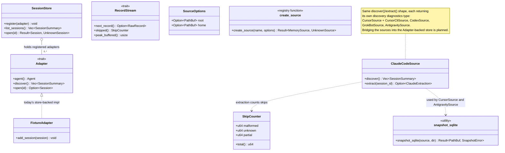

# Chapter 3 — Importers / Change Data Capture (placeholder)

Specs for the CDC pipeline (detecting new or changed transcripts, the
normalization handoff, retries) and for each per-agent importer live here
once written. Bulk loading is not the model: each importer watches its
source and emits normalized records as they appear.

Per-agent importer specs: `claude_code/adapter.feature`, `cursor/adapter.feature`,
`codex/adapter.feature`, `grok_bot/adapter.feature`, `antigravity/adapter.feature`
(all tagged `@wip` until each importer's implementation lands).
Shared contract: `contract.feature` (implemented); WAL snapshotting:
`wal_snapshot.feature` (implemented). Narrative pages: `src/spec/ch03_importers/`.

## How to add a sixth agent

Every source obeys the same protocol: discovery finds sessions under the
source's roots and is incremental by identity; extraction streams records
one at a time with a `SkipCounter` (malformed / unknown / partial — skipped
and counted, never fatal); and the source is only ever read — there is no
write surface, and hot SQLite stores go through `snapshot::snapshot_sqlite`
(a read-only WAL-safe snapshot copy). Implement a source with the same
`discover()` / `extract()` shape as the five (`ClaudeCodeSource`,
`CursorSource` + `CursorCliSource`, `CodexSource`, `GrokBotSource`,
`AntigravitySource`), map its records onto the chapter-1 schema (park
anything you do not model in `Part::Extra` and each part's `extra`), and
write the Gherkin parity spec with synthetic fixtures under
`<agent>/adapter.feature`.

